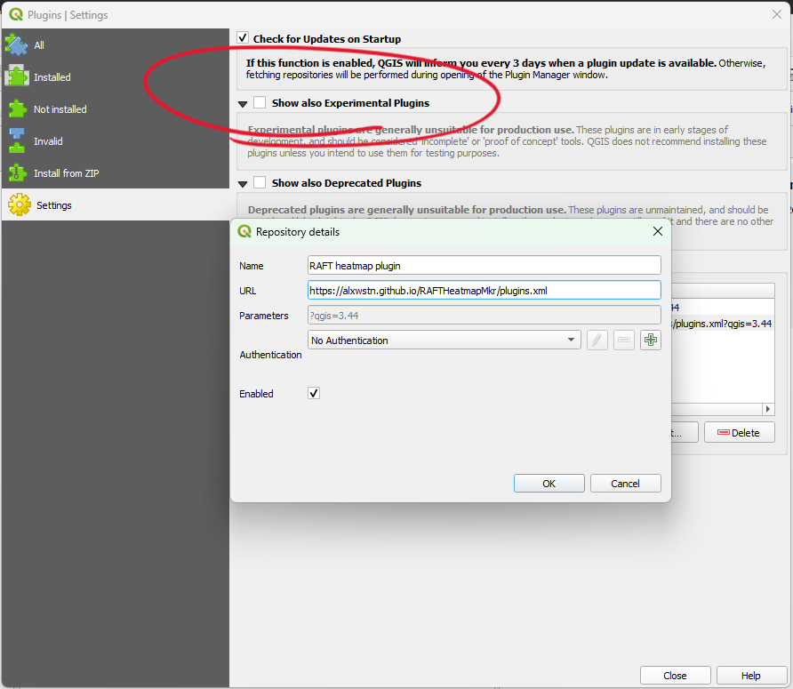

# Installation

## Latest released version

The plugin is automatically packaged for each commit to main, so you can use this address as repository URL in your QGIS extensions manager settings:

```url
https://alxwstn.github.io/RAFTHeatmapMkr/plugins.xml
```
Installation Steps:

1. Launch QGIS and open the Plugin Manager: Select `Plugins` from the menu toolbar, then `Manage and Install Plugins`
2. Select `Settings`. In the Plugin Repositories, select `Add`. Set the `Name` field to `RAFT heatmap plugin`, and the url field to `https://alxwstn.github.io/RAFTHeatmapMkr/plugins.xml`. Select `OK`.

    
3. Select `All` on the left hand menu, then filter to `raft`
4. Select `raft_heatmap` and install

## Beta versions released

Enable experimental extensions in the QGIS plugins manager settings panel (see circled option in screenshot below).
