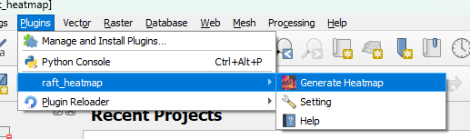
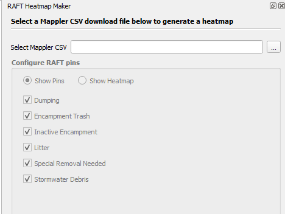
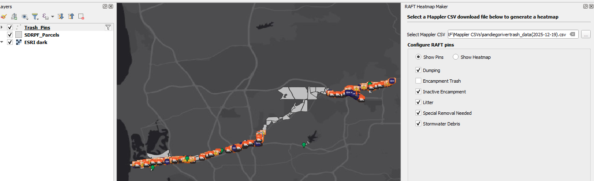
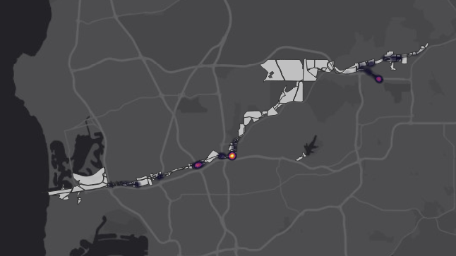

# Usage

1. First, make sure you have the plugin [properly installed](./installation.md).
2. In QGIS, open a new empty project
3. Launch the plugin from the plugins menu:

4. The plugin interface will open, docked to the right hand side of the QGIS window:

5. Select a csv that you have exported from Mappler:

6. You can now filter the pins by category. This updates the Trash Pins layer's Provider Feature Filter.
7. Select the `Show Heatmap` radio button to view the pins as a heatmap (take a look at the Trash Pins layer symbology settings to see how this works!):

